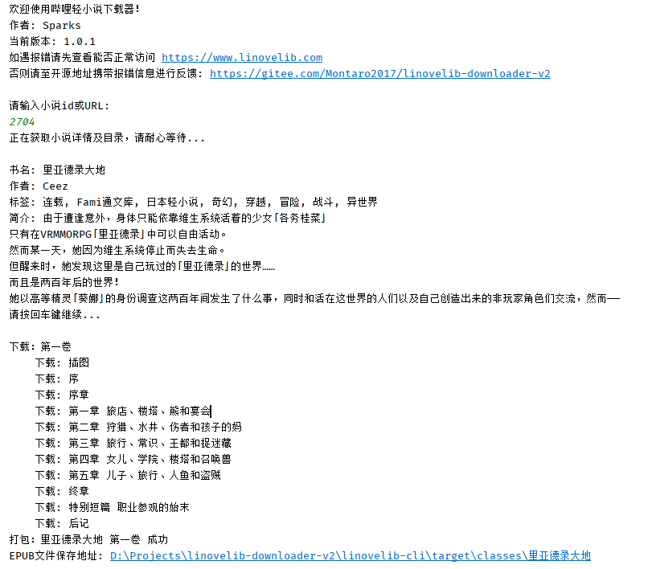
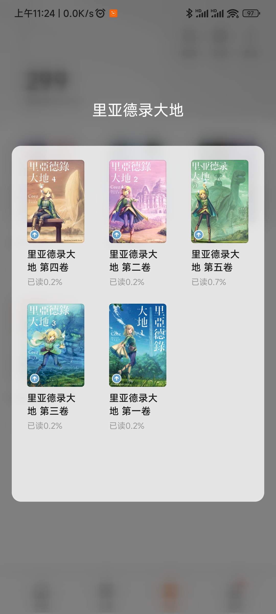
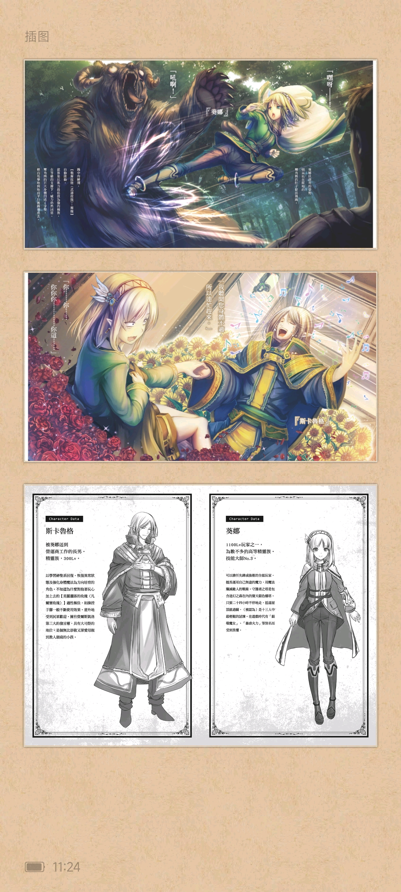
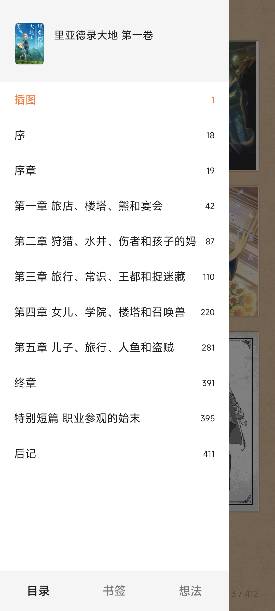
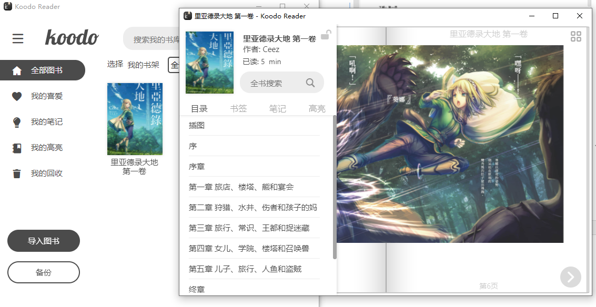

# 哔哩轻小说打包下载器

## 介绍

本项目用于从[哔哩轻小说](https://www.linovelib.com)网站下载小说并打包成EPUB

输入URL或ID即可自动下载并打包成EPUB格式，支持封面、插图以及目录！

### 截图

### EPUB预览

#### 多看阅读

**插图支持交互模式，点击可全屏查看**

#### Koodo Reader

## 开发计划

1. - [x] (已完成)~~添加日志功能~~

2. - [ ] (似乎不可行)尝试更换为移动版接口以解决部分小说内容缺失问题

3. - [x] (已适配多看阅读交互模式)~~尝试添加插图点击查看功能，待研究~~
